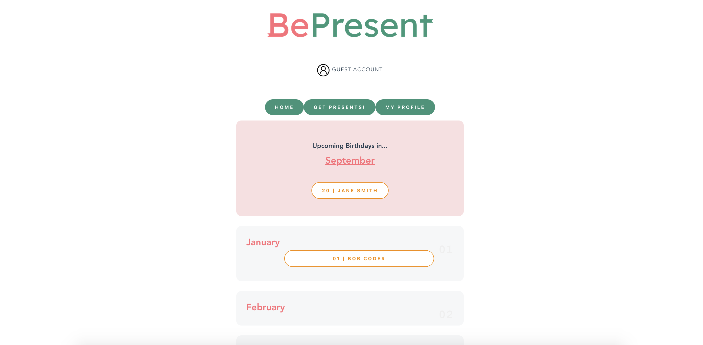

## Live Site

https://bepresent.fly.dev/

## Project Summary

Backend for BePresent- a social gift recommendation app.
Users can add and delete other users, and get recommendations from Etsy based on their interests.
This backend includes a webscraper, which utilises the npm package cheerio.

Users db is built on MongoDB Atlas and hosted with fly.io, passwords are hashed using bcrypt and user ID's are provided with uuidv4.  
Built in Node.JS with Express.

## How It's Made:

**Tech used:** Javascript, Node.js, Express, MongoDB Atlas
Our webscraper takes categories input by the user on the front end, mapping through each category to scrape products from Etsy using the npm package Cheerio to parse the html. The full product list is then returned to the front end, which randomises the items rendered on the page. 
Users db is built with MongoDB Atlas and hosted with fly.io, where hashed passwords are input using bcrypt and user ID's are provided with uuidv4.

Full TDD was implemented in this backend, following the MVC model.

## Lessons Learned:

A variety of new concepts were explored in the development of this app:

Hashing passwords for safe storage of credentials on a hosted database.
Connecting to the MongoDB client and hosting with fly.io
Webscraping- How to navigate and retrieve data from public sites with by parsing html.

## Improvements:

If more time was spent on this project, I would like to include authentication with JSONWebtoken or otherwise.
If the app were to scale, it would be more appropriate to store webscraped products on a database so that a new request is not made each time. This would include request throttling, and also provide a backup should a scrape be unsuccessful. 

## Install Dependencies

By default, 'npm install' will install all modules listed as dependencies in package.json. In this case this will install: 

    "bcrypt": "^5.0.1",
    "cors": "^2.8.5",
    "dotenv": "^16.0.2",
    "express": "^4.18.1",
    "mongodb": "^4.9.1",
    "nodemon": "^2.0.19",
    "uuid": "^9.0.0"

If you would like to run the tests contained in the test folder you will also need to install the following as devDependencies (npm install -D "jest" for example):

"jest": "^27.5.1", "supertest": "^6.2.4".

## .env

In order to connect this server to your database you will need to setup a '.env' file which contains the following:

"URI=<'YOUR URI'>"

Each model is designed to connect to a database called "test-data" when running the tests and "dev-data" when accessing the live version. Be sure to stick to this naming convention when setting up your database otherwise you will need to edit each model to reflect this difference.

## Version Requirements

In order to run this project the minimimum version requirements are as follows:

Node.js: "18.6.0"
